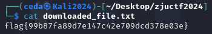

# Easy Pentest Write Up

This is a web challenge from a mini CTF competition in my school: 

Challenge first look, We receive a txt file containing:

```
AccessKey: ~~~ #privacy purpose
SecretKey: ~~~ #privacy purpose
Target: https://oss-test-qazxsw.oss-cn-beijing.aliyuncs.com/fffffflllllaaaagggg.txt
```

Looking at the link we are dealing with  **Alibaba Cloud Object Storage Service (ACOSS)** and we are given the `AccessKey` and `AccessSecretKey`. 

by using a simple python script like this :arrow_double_down:
```python
import oss2

# 		  AccessKeyID | AccessKeySecret
auth = oss2.Auth('~~~', '~~~')

# setting up the connection to the specific OSS bucket
bucket = oss2.Bucket(auth, 'https://oss-cn-beijing.aliyuncs.com', 'oss-test-qazxsw')

# file fetching
try:
    result = bucket.get_object('fffffflllllaaaagggg.txt')
    # Print or save the result
    with open('downloaded_file.txt', 'wb') as f:
        f.write(result.read())
    print("File downloaded successfully.")
except oss2.exceptions.AccessDenied as e:
    print("Access Denied: ", e)

```

The flag then written in the output:



**The flag is :** flag{99b87fa89d7e147c42e709dcd378e03e}
