# **Easy Web** Write Up

This is a challenge from my school website about web penetration testing

## Web First Look:

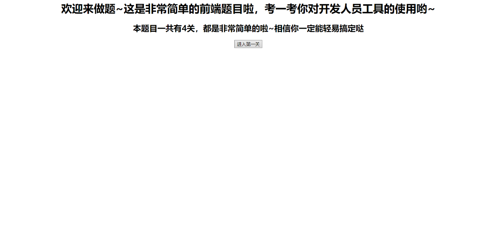

When I press the button, it transfer me to 1.php

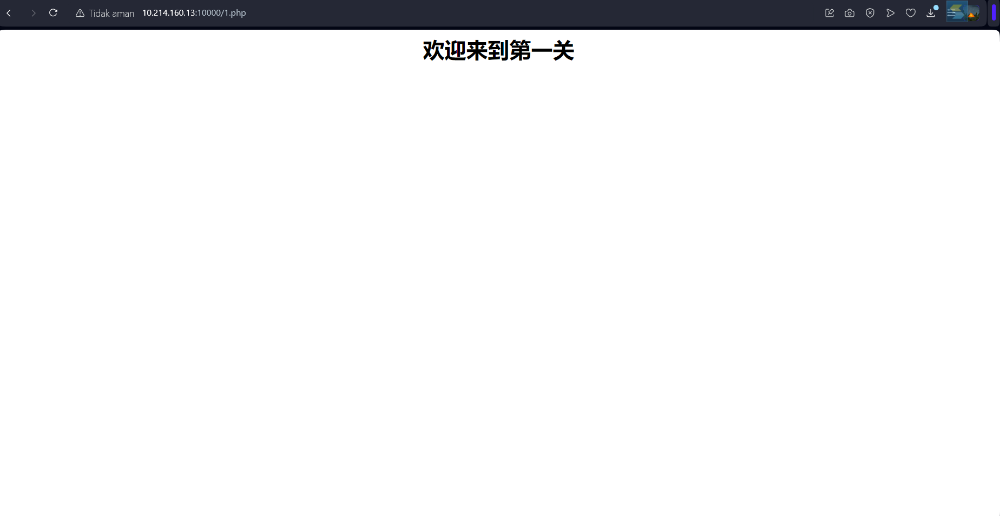

inspecting the html code, I found an odd comment line

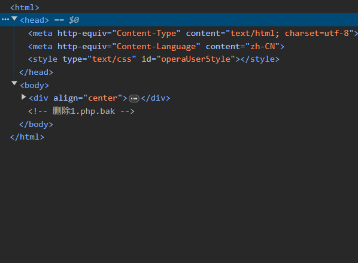
talkingg about .bak file, .bak file is a back up file format, so my next step would be to use the button on the previous page and use the button to acess the 1.php.bak file

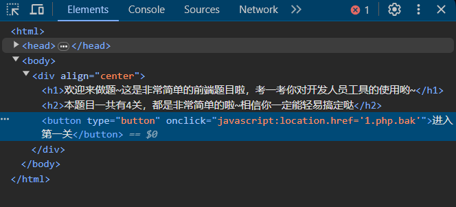

simply replace 1.php to 1.php.bak 

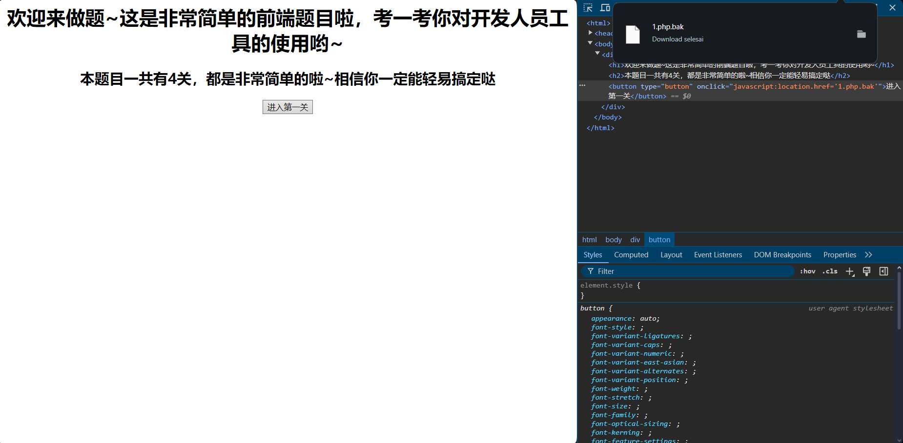

and a back up file is found, and directly downloaded

after seing **the2nd.php** lets access it via the button on the main page again

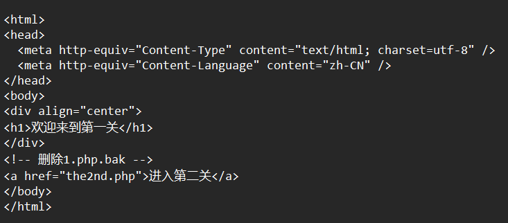

Now we are at the level 2, when we submit anything from the form the response is always the same

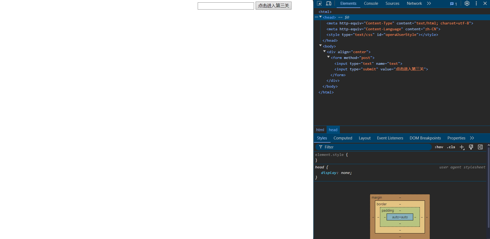

So finally I checked the network tab to see any **suspicious** payload activity

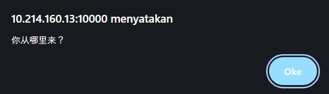

In the referer I found the 3rd.php file appeared, let's access that via the home page button again

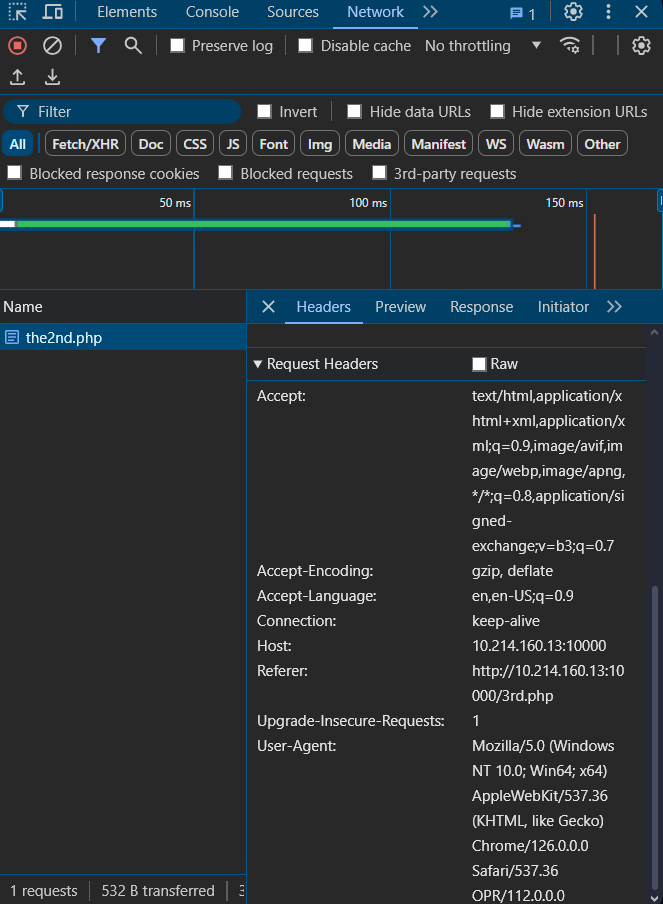

We are now at the 3rd level of the challenge, let's press the button, 

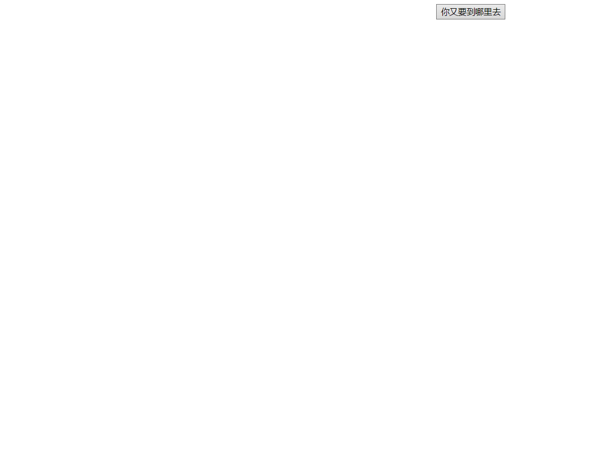

Nothing suspicious going around, Let's check the network tab

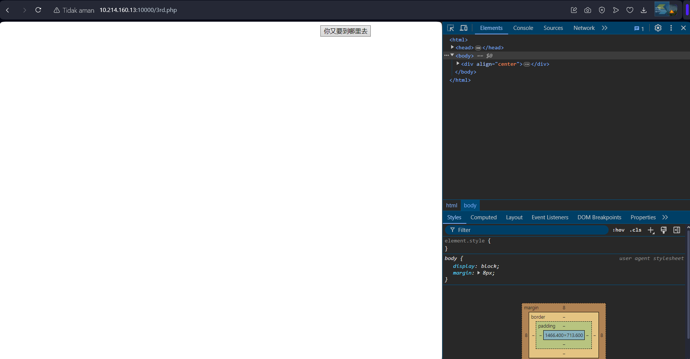

Yeah, there is one more php page going around (wozaizheli.php)

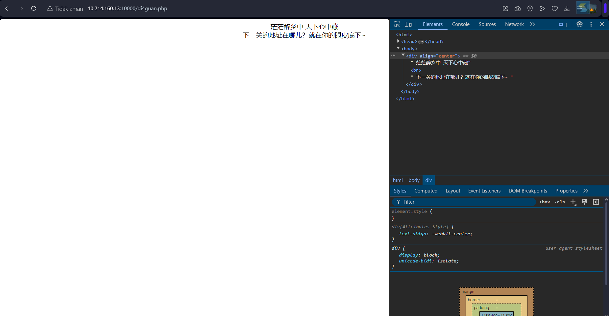

now it ask us to press the button that dissapeared, well one way to brute force this is by changing the html code

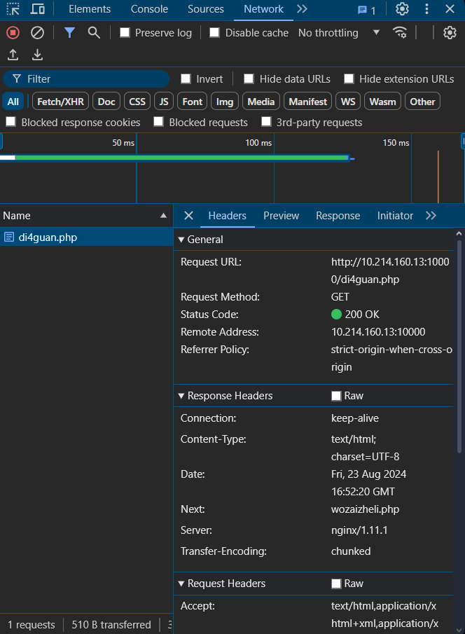

here by changing the id to something else, the script won't effect the div block so the button won't disappear

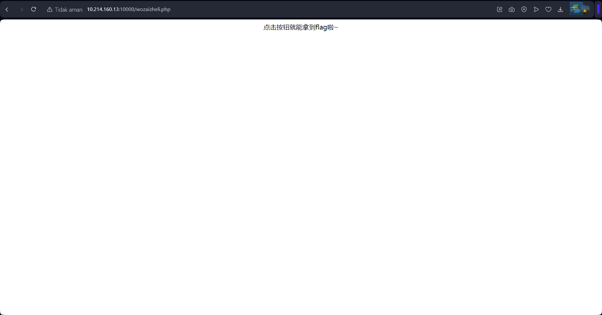

changing the idea worked and now we can just press the button to obtain the flag

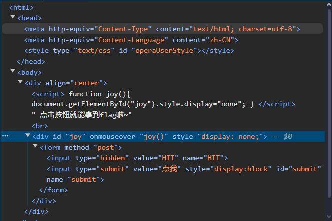

flag : AAA{y0u_2a_g0od_front-end_Web_developer}
