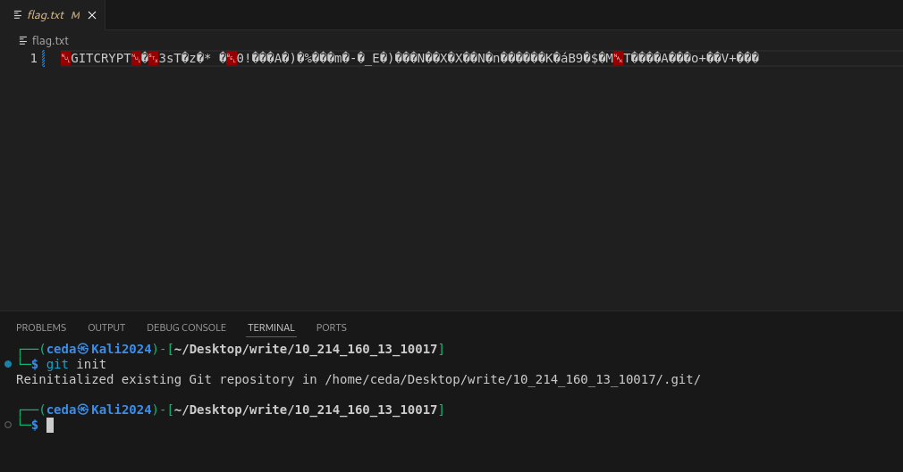

# Flag403 Write Up

This is a challenge from my school website about web penetration testing

## Web First Look:


At first I tried to inspect and found nothing, my first step is to use the dotgit extention to download the .git file from the incase there are any .git repositories being leaked.


And after downloading it, I'm still not sure this is all of the contents inside the repositories, so I continue with applying GitHack attack to the site, incase there are still missing files


here, there are 3 more files leaked from the .git file


one of them is a flag.txt which got encrypted by git-crypt. Next I'm putting the flag.txt and index.html to the .git repositories. 

Since git-crypt needs a key to be unlocked, I tried blind url directory search to find any possible default directory when first creating a git-crypt keys

usually ***/.git/git-crypt/keys/default*** is the default directory for the git-crypt keys, 


after downloading the keys, let's put the flag.txt, index.html, and default file to the git repositories (put the keys in the same directory, I'm creating new folder for it)

then I open terminal from th visual studio code to start unlocking the flag.txt using the key I receive.

let's first initialize the git using ***git init***



and check for any status that need to be commited


and make the .git attributes to target the flag.txt for unlocking with 

```bash
echo "flag.txt filter=git-crypt diff=git-crypt" > .gitattributes
git add .gitattributes
git commit -m "Tell git-crypt to encrypt flag.txt"
```


And

```bash
git-crypt unlock .git/git-crypt/keys/default
```


and the flag is

Flag: **AAA{flag_ix2mkbPEX3bmkHSB_gitcrypt_is_not_that_secure_qqgroup_~~}**

~~ is for privacy purpose


<https://dev.to/heroku/how-to-manage-your-secrets-with-git-crypt-56ih>
