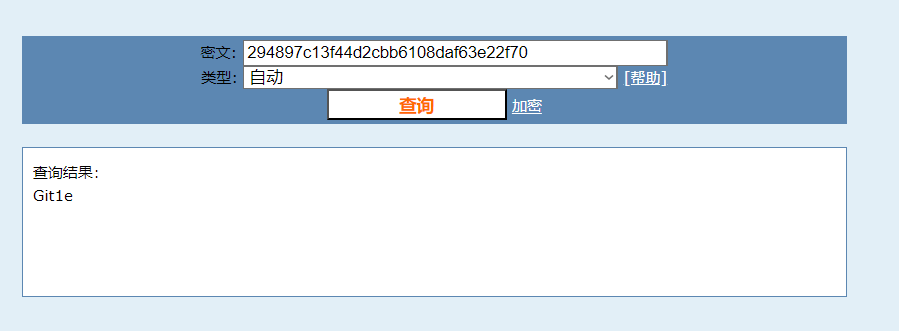

# **Git-Leak** Write Up

**Git leak** is an accidental exposure of sensitive information through a Git repository. This typically occurs when developers inadvertently commit sensitive files or information to a Git repository, which can then be accessed by others, especially if the repository is public.

## Web First Look:

Since the title already gave a hint, we just need to directly use gitHack to uncover the .git leaked repositories (I'm using linux bash)

After running the command, notice an index.php file gets retrieved let's see

this website uses our input and do the MD5 operation and compare the value to **294897c13f44d2cbb6108daf63e22f70**

next, let's reverse the md5 comparison value with **cmd5.com** website to reverse the MD5 function.

and the result is **Git1e**, now let's input the result to the form given by the website

and It's correct, the final flag is

flag : **AAA{Git1e_qq_qun_~~~~~}**      ~~~~~ is hidden for privacy purpose

