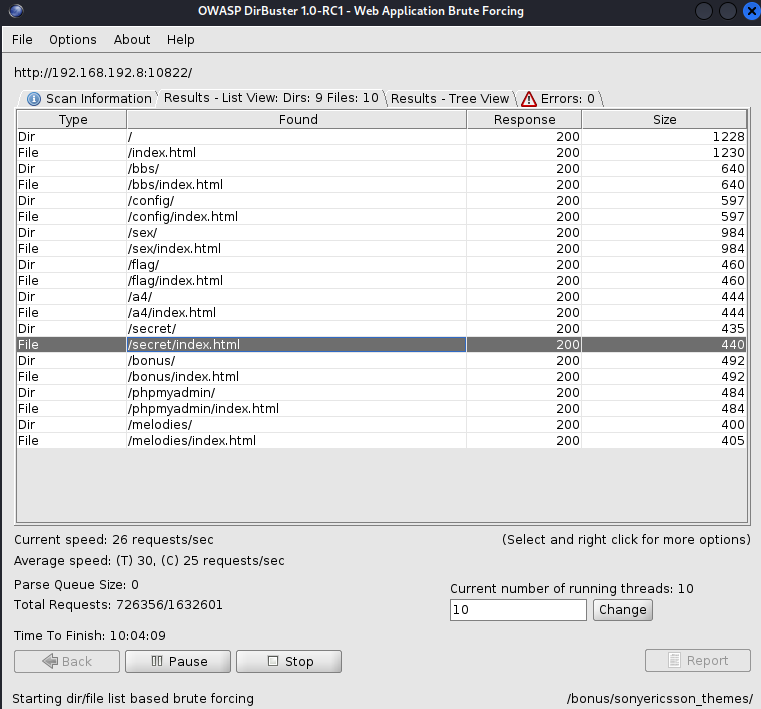

# Scan Write Up

this question is from my school CTF challenge

First we initialize the socks5,
```bash
ssh user@10.214.160.13 -p 10802 -D 10899 -N
```

and set the **'sbus'** as the password to initialize the socks5

then we edit the ~etc/proxychains4.config

directly use 

```bash
sudo nano /etc/proxychains4.conf
```

and add 

```bash
socks5 127.0.0.1 10899
```

to directly using port 10899 for scanning

after running 

``` bash
proxychains4 nmap -p 9000-11000 -vv 192.168.192.3
```


we found out that port 10822 is open

after using **curl** command I found this:

```bash
proxychains4 curl http://192.168.192.8:10822
```


here is the formated output:

```html
<!doctype html>
<html lang="zh-CN">
	<head>
    	<meta charset="utf-8"/>
    	<title>AAA web5 端口扫描与目录爆破(part2)</title>
    	<meta name="author" content="aploium"/>
	</head>
	<body>
		<h1>AAA web5 端口扫描与目录爆破 (part2)</h1>
		<pre>
非常棒, 你已经成功扫描出端口了!
如果你还没有加qq群, 请收好part1的flag(这个flag对已经加群了的小伙伴无效): 
AAA{web5_part1_passed_and_welcome_to_aaa_qq_group_~~~~} ~~ for privacy purpose

以下是part2的说明(目录爆破):
Q: 什么是目录爆破? 为什么要爆破目录?
A: 正常情况下, 网站的某些目录是没有直接进入的入口的, 比如
  www.foo.com/secret/admin.php
  		<del>melody.com/resource/小电影.torrent</del>
  这些隐藏的目录可能会给攻击带来很大的方便, 提供网站的更多信息或者增加攻击面.
  目录爆破就是根据一个庞大的字典, 来一个个测试这个目录是否存在. 当然还会加上爬虫的辅助
  google是最好的老师

Q: 使用什么工具?
A: DirBuster 或者它的集成版 Zap (看喜好, zap整体功能比较强, 但是就扫目录这个功能上可定制性比较差)
  burpsuite也可以用于目录爆破

Q: 目录字典呢?
A: DirBuster(0.12) 自带目录字典, zap被阉割了, 如果是用zap的话请下载DirBuster里面的目录字典
  在本次扫描中, 为了减轻服务器压力, 请使用 directory-list-lowercase-2.3-small.txt 这个

Hints:
  本次扫描中, 只会出现 .html 后缀的文件
  目录爆破可能需要非常长的时间, 请耐心等待(*ˉ︶ˉ*)

------
author: Aploium
		</pre>
	</body>
</html>             
```

and by the clue given above we directly use dirbuster to bruteforce the directory using the directory-list-lowercase-2.3-small.txt file downloaded from github

```bash
proxychains4 dirbuster
```

the process while running the dirbuter:


after further directory searching, here is some of the result before finding the real flag:



List of directory found : <http://192.168.192.8:10822> this is the curl result 

via:

```bash
proxychains4 curl http://192.168.192.8:10822/~~/~.html #mainly index.html
```


* /index.html (default webpages)
* /bbs/index.html

```html
<!doctype html>
<html lang="zh-CN">
<head>
    <meta charset="utf-8"/>
    <title>bbs</title>
    <meta name="author" content="aploium"/>
</head>
<body>
<h1>bbs</h1>
<pre>
很好！（此回复虽有且仅有两个字，却深刻地表达了回复人的深深的祝福，可谓言简意赅，一字千金，字字扣
人心弦，字字催人泪下，足可见回复人扎实的文字功底和信手拈来的写作技巧及惨绝人环的创新能力。实在佩
服佩服！再加上以感叹号收尾，点睛之笔，妙笔生花，意境深远，照应前文，升华主题，把回复人的感情表达
得淋漓尽致，给人无限感动和惆怅，有浑然天成之感，实乃回复中之极品，祝福中之绝笔。）
</pre>
</body>
</html>
```

* /secret/index.html

```html
<!doctype html>
<html lang="zh-CN">
<head>
    <meta charset="utf-8"/>
    <title>秀恩爱</title>
    <meta name="author" content="aploium"/>
</head>
<body>
<pre>
吱吱我爱你~
</pre>
</body>
</html>
```


* /sex/index.html

```html
<!doctype html>
<html lang="zh-CN">
<head>
    <meta charset="utf-8"/>
    <title>你们要的东西(不是flag)</title>
    <meta name="author" content="aploium"/>
</head>
<body>
<h1>你们要的东西(不是flag)</h1>
<!--Hint: base64-->

5Lul54Ot54ix56WW5Zu95Li66I2jCuS7peWNseWus+elluWbveS4uuiAuwrku6XmnI3liqHkurrmsJHkuLrojaMK5Lul6IOM56a75Lq65rCR5Li66IC7CuS7peW0h+WwmuenkeWtpuS4uuiNowrku6XmhJrmmKfml6Dnn6XkuLrogLsK5Lul6L6b5Yuk5Yqz5Yqo5Li66I2jCuS7peWlvemAuOaBtuWKs+S4uuiAuwrku6Xlm6Lnu5PkupLliqnkuLrojaMK5Lul5o2f5Lq65Yip5bex5Li66IC7CuS7peivmuWunuWuiOS/oeS4uuiNowrku6Xop4HliKnlv5jkuYnkuLrogLsK5Lul6YG157qq5a6I5rOV5Li66I2jCuS7pei/neazleS5see6quS4uuiAuwrku6XoibDoi6blpYvmlpfkuLrojaMK5Lul6aqE5aWi5rer6YC45Li66IC7CgoKCgoKCgoKCgoKCgoK55CJ55KD56We56S+
</body>
</html>
```

the base 64 encoding doesn't include any clue or flag, but after decoding here is the result:

```
以热爱祖国为荣
以危害祖国为耻
以服务人民为荣
以背离人民为耻
以崇尚科学为荣
以愚昧无知为耻
以辛勤劳动为荣
以好逸恶劳为耻
以团结互助为荣
以损人利己为耻
以诚实守信为荣
以见利忘义为耻
以遵纪守法为荣
以违法乱纪为耻
以艰苦奋斗为荣
以骄奢淫逸为耻


琉璃神社
```


* /flag/index.html

```html
<!doctype html>
<html lang="zh-CN">
<head>
    <meta charset="utf-8"/>
    <title>Flag</title>
    <meta name="author" content="aploium"/>
</head>
<body>
<h1>Flag不在这里, 请继续 :)</h1>
<pre>
</pre>
</body>
</html>
```


* /config/index.html

```html
<!doctype html>
<html lang="zh-CN">
<head>
    <meta charset="utf-8"/>
    <title>config</title>
    <meta name="author" content="aploium"/>
</head>
<body>
<h1>config</h1>
<pre>
[mysql]
database = zjutools_mysql
user = ztdb_user
password = FKgSMUaN2CZA7xW6
host = 127.0.0.1
port = 3306
default-character-set = utf8
</pre>
</body>
</html>
```

<I even managed to retrieve sensitive data like the data base account and password>

* /melodies/index.html

```html
<!doctype html>
<html lang="zh-CN">
<head>
    <meta charset="utf-8"/>
    <meta name="author" content="aploium"/>
</head>
<body>
melody不是基佬
</body>
</html>
```


* /a4/index.html

```html
<!doctype html>
<html lang="zh-CN">
<head>
    <meta charset="utf-8"/>
    <title>a4</title>
    <meta name="author" content="aploium"/>
</head>
<body>

</body>
</html>
```

and for this one after downloading the image via,

```bash
proxychains4 curl -O http://192.168.192.8:10822/a4/A4toCDbox.jpg
```

it shows a picture with no clue related to the flag (after further steg apporach) :


* /bonus/index.html

```html
<!doctype html>
<html lang="zh-CN">
<head>
    <meta charset="utf-8"/>
    <title>bonus</title>
    <meta name="author" content="aploium"/>
</head>
<body>
<h1>bonus</h1>

</body>
</html>
```

via:

```bash
proxychains4 curl -O http://192.168.192.8:10822/bonus/20150723_170940.jpg
```

retrieved:


* /phpmyadmin/index.html

```html
<!doctype html>
<html lang="zh-CN">
<head>
    <meta charset="utf-8"/>
    <title>Flag</title>
    <meta name="author" content="aploium"/>
</head>
<body>
<h1>Flag</h1>
<pre>
AAA{Earth_Three-body-Organization}
</pre>
</body>
</html>
```

and there it is, the flag is contained on **index**.**html** from **phpmyadmin** directory :smile:

Flag : **AAA{Earth_Three-body-Organization}**
